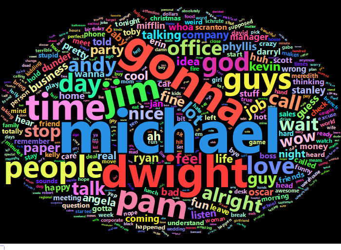
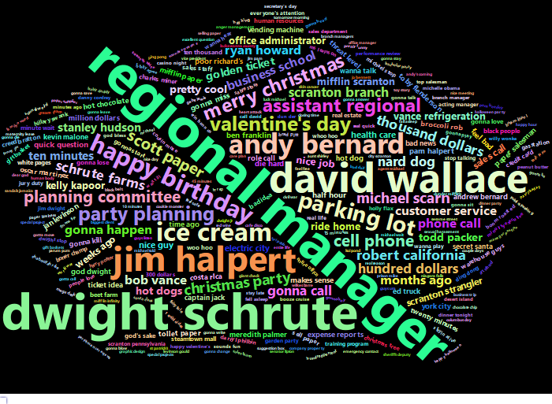
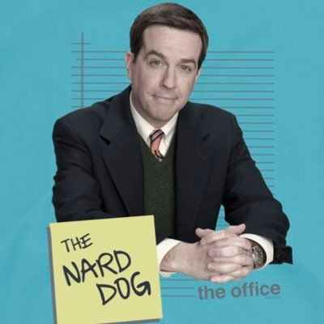

```{r setup, include=FALSE}
knitr::opts_chunk$set(echo = FALSE, warning = FALSE, message = FALSE)
```

```{r libraries, include=FALSE}

library(readr)
library(tidytext)
library(tidyverse)
library(stringr)
library(ggplot2)
library(wordcloud)
library(dplyr)
library(SnowballC)
library(scales)
library(tm)
library(RColorBrewer)
library(syuzhet)
library(reshape2)
library(textdata)
library(igraph)
library(tidygraph)
library(ggraph)
library(widyr)
library(topicmodels)
library(gganimate)
library(schrute)
library(plotly)
library(githubinstall)
library(gghighlight)
library(wordcloud2)
library(gganimate)
library(sweary)
library(gifski)
library(magick)
library(webshot)
library(htmlwidgets)
library(scales)


```


## Dataset di partenza

Il dataset di partenza viene preso dalla libreria schrute.
Contiene tutte le linee di dialogo delle 9 stagioni di the Office organizzate per persoanggio ed episodio.
Sono presenti anche i ratings ricevuti su IMDB per i vari episodi.  
{width=100%}
 
## Che cos'è?
The Office è una serie televisiva statunitense, è stata girata in una configurazione a telecamera singola – senza il pubblico in studio o le risate registrate – per dare l'idea di un vero documentario.
La serie è stata acclamata dal pubblico e dalla critica, aggiudicandosi diversi premi.
The Office segue le vite di ogni giorno dei dipendenti della Dunder Mifflin-Scranton, guidati dal direttore della filiale Michael Scott e dal suo braccio destro Dwight, il quale pero non e il preferito di Michael che gli preferisce Jim, il quale pero non ha interessi ad impegnarsi nel lavoro e fa il minimo indispensabile passando le giornate a scherzare con la receptionist dell'ufficio Pam (sua gran cotta). Altri personaggi dell'ufficio sono Angela, Kevin, Oscar e Phillis (e tanti altri)


   
## Cosa faremo?  
1. Troveremo alcune statistiche generali sulla serie
2. Text mining sui dialoghi
3. Sentiment analysis sulla serie 
e molte altre cose...


   
## Chi ha piu battute?  
```{r lines_for_char, out.height = "100%", out.width = "100%"}
Transcripts <- schrute::theoffice

Transcripts%>%
  count(character, sort = TRUE) %>%
  mutate(character = fct_reorder(character, desc(n)))%>%
   top_n(15) %>%
  ggplot( aes(x=character, y=n)) + 
  geom_bar(stat = "identity",show.legend = FALSE)+
  coord_flip()
```
Ovviamente __Michael__!  
   
## Popolarita in relazione ai vari episodi
  
```{r ratings, out.height = "100%", out.width = "100%"}
lol <-Transcripts%>%
 mutate(ep_key = paste0("s", season, "e", episode)) %>%
    select(ep_key, episode_name, imdb_rating,season) %>%
    unique()

p<-ggplot(lol, aes(ep_key, imdb_rating,color=season)) +
    geom_point() +
   
  geom_smooth() +

  scale_colour_gradientn(colours = c("darkred", "orange", "yellow","brown","green","darkblue","purple","pink","blue"))   + 
  theme(axis.text.x=element_blank(),legend.position = "none")

ggplotly(p)
```
Notiamo che dopo meta serie i voti iniziano a calare in media, ma in generale il rating rimane alto
   
## Chi compare in piu episodi?  
```{r episodes_with_char, out.height = "100%", out.width = "100%"}

troll <-Transcripts%>%
 mutate(ep_key = paste0("s", season, "e", episode)) %>%
    select(ep_key, episode_name, character,season) %>%
    unique()%>%
count(character)%>%
arrange(n)


  troll%>%
  mutate(character = fct_reorder(character, desc(n)))%>%

   top_n(15) %>%
  
  ggplot( aes(x=character, y=n,fill=character)) + 
  geom_bar(stat = "identity",show.legend = FALSE)+
     
  coord_flip()
```

Nelle ultime stagioni la mancanza di Michael nel ufficio ha fatto si che il grafico non ricalcasse quello del numero totale di battute nella serie  
  
Inoltre notiamo che i personaggi piu presenti sono quelli del ufficio dalla prima stagione

## Parole per personaggio  
```{r words_for_char, out.height = "100%", out.width = "100%"}
lines_manip <- Transcripts %>%
    select(season, episode, character, text) %>%
    tidytext::unnest_tokens(word, text) %>%
    mutate(ep_key = paste0("s", season, "e", episode)) %>%
    add_count(character, ep_key) %>%
    rename(char_words = n) %>%
    add_count(ep_key) %>%
    rename(ep_words = n)

lines_sum <- lines_manip %>%
    select(ep_key, character, char_words, ep_words,season,episode) %>%
    distinct()
rip<-lines_sum %>% 
  filter(char_words>200)%>%
   filter(character%in% c("Michael","Dwight","Jim","Andy","Angela","Pam","Oscar","Phyllis","Ryan","Kevin","Toby","Derryl","Kelly","Creed","Nellie","Stanley","Meredith","Gabe","Jo","Deangelo","Clark","Pete","todd","david","Jan"))%>%
    distinct()

c<-ggplot(rip, aes(fill=character, y=char_words, x= episode)) + 
    geom_bar(position="stack", stat="identity")+
   facet_wrap(~season, ncol = 3, scales = "free_x")
ggplotly(c)
```
Come vediamo __Michael__ e quello piu presente in tutti gli episodi tranne che per le ultime 2 stagioni dove fa solo da comparsa, questo spiega sia come mai e colui con piu linee di dialogo e sia perche non e il personaggio presente in piu episodi
```{r Tokenizing, out.height = "100%", out.width = "100%", include=FALSE}
Tokenized <- Transcripts %>%
  unnest_tokens(word, text)

Tokenized <- Tokenized %>%
  anti_join(stop_words)
```
   
## Parole piu dette  
```{r most_used_words, out.height = "100%", out.width = "100%"}
n<-Tokenized %>%
  count(word, sort = TRUE) %>%
  filter(n > 600) %>%
  mutate(word = reorder(word, n)) %>%
  ggplot(aes(word, n, fill = word)) +
   geom_col(show.legend = FALSE) +
  xlab(NULL) +
  coord_flip()+
  theme(legend.position="none")
ggplotly(n)
```
ora vedremo di togliere alcune delle parole meno importanti e vedere cosa ne esce fuori
   
## Wordcloud  
```{r most_used_words2, out.height = "100%", out.width = "100%"}


rio<-Transcripts %>%
  unnest_tokens(word, text)%>%
    anti_join(stop_words)%>%
  filter(!word %in% c("yeah","hey","ha","mm","hmm","na","uh","um")) %>%
  count(word,sort=TRUE) 
w1<- wordcloud2(rio, size = 0.7, shape = 'diamant', color='random-light', backgroundColor="black")
 
 saveWidget(w1, '1.html', selfcontained = F)
webshot('1.html', '1.png', vwidth=700,vheight=500, delay = 5)

#
```


   
## Parole piu dette dopo il porter's word stemming  
```{r word_stemming, out.height = "100%", out.width = "100%"}
# Porter's word stemming

Tokenized <- Tokenized %>%
  mutate(word = wordStem(word)) # stemming

m<-Tokenized %>%
  count(word, sort = TRUE) %>%
  filter(n > 600) %>%
  mutate(word = reorder(word, n)) %>%
  ggplot(aes(word, n, fill = word)) +
   geom_col(show.legend = FALSE) +
  xlab(NULL) +
  coord_flip()+
  theme(legend.position="none")
ggplotly(m)
```
Abbiamo utilizzato un metodo per riportare le parole alla propria radice per vedere se cambia qualcosa

```{r frequency, out.height = "100%", out.width = "100%", include=FALSE}
frequency <- 
 Tokenized %>%   count(character,word) %>%
 group_by(character) %>%
  mutate(proportion = n / sum(n)) %>% 
  select(-n) %>% 
  spread(character, proportion) 

  
```
   
## Frequenza di utilizzo di parole comparata tra Michael e Dwight  
```{r freq_michael_dwight, out.height = "100%", out.width = "100%"}
ggplot(frequency, aes(x = `Michael`, y = `Dwight`)) +
  geom_abline(color = "gray40", lty = 2) +
  geom_text(aes(label = word), check_overlap = TRUE, vjust = 1.5) +
  scale_x_log10(labels = percent_format()) +
  scale_y_log10(labels = percent_format()) +
  labs(y = "Michael", x = "Dwight") +
  theme_bw()
```

```{r corr_michael_dwight, out.height = "100%", out.width = "100%"}
# quantify correlation
cor.test(frequency$Michael,  frequency$Dwight)
```
   
## Frequenza di utilizzo di parole comparata tra Jim e Dwight  
```{r freq_jim_dwight, out.height = "100%", out.width = "100%"}
ggplot(frequency, aes(x = `Jim`, y = `Dwight`)) +
  geom_abline(color = "gray40", lty = 2) +
  geom_text(aes(label = word), check_overlap = TRUE, vjust = 1.5) +
  scale_x_log10(labels = percent_format()) +
  scale_y_log10(labels = percent_format()) +
  labs(y = "Jim", x = "Dwight") +
  theme_bw()
cor.test(frequency$Jim,  frequency$Dwight)
```
   
## Frequenza di utilizzo di parole comparata tra Jim e Michael  
```{r freq_jim_michael, out.height = "100%", out.width = "100%"}
m<-ggplot(frequency, aes(x = `Jim`, y = `Michael`)) +
  geom_abline(color = "gray40", lty = 2) +
  geom_text(aes(label = word), check_overlap = TRUE, vjust = 1.5) +
  scale_x_log10(labels = percent_format()) +
  scale_y_log10(labels = percent_format()) +
  labs(y = "Jim", x = "Michael") +
  theme_bw()
m

cor.test(frequency$Jim,  frequency$Michael)
```
```{r sentiment, out.height = "100%", out.width = "100%", include=FALSE}
sentimenti <- Tokenized %>%
  inner_join(get_sentiments("bing")) %>%
  count(season,episode_name, index = interaction(season,episode,sep=','), sentiment,episode) %>%
  spread(sentiment, n, fill = 0) %>%
  mutate(sentiment = positive - negative)
```
   
## Bing sentiment analysis per ogni episodo  
```{r sent_anal_per_ep, out.height = "100%", out.width = "100%"}
w<-ggplot(sentimenti, aes(episode, sentiment, fill = sentiment)) +
  geom_col(show.legend = FALSE) +
  facet_wrap(~season, ncol = 3, scales = "free_x")
ggplotly(w)
```
   
## NRC sentiment analysis per vedere l'emozione dominante per ogni personaggio  
```{r sent_anal_per_char, out.height = "100%", out.width = "100%"}
  tidy_books <- Transcripts %>%
  group_by(character) %>%
  summarize(text = toString(text)) %>%
  unnest_tokens(word, text)

#anger,anticipation,disgust,fear,joy,sadness,surprise,trust

rock <- tidy_books %>%

  
  inner_join(get_sentiments("nrc")) %>%
  filter(!sentiment %in% c("positive", "negative")) %>%
  
  group_by(character,sentiment) %>%
  summarise(cnt = n()) %>%
  filter(cnt>50)%>%
  mutate(freq = round(cnt / sum(cnt), 3)) %>%
  
  filter(freq== max(freq))%>%
  filter(!character %in% c("Roy"))%>%
  arrange(desc(freq))
 

rock%>%
 
 

  ggplot(aes(interaction(character,sentiment,sep=':'), freq, fill = character)) +
  geom_col(show.legend = FALSE)+
coord_flip()

```

```{r word_count, out.height = "100%", out.width = "100%", include=FALSE}
bing_word_counts <- Tokenized %>%
  inner_join(get_sentiments("bing")) %>%
  count(word, sentiment, sort = TRUE) %>%
  ungroup()

```
   
## Le 20 parole negative e positive piu presenti   
```{r neg_pos_words, out.height = "100%", out.width = "100%"}
bing_word_counts %>%
  group_by(sentiment) %>%
  top_n(20) %>%
  ungroup() %>%
  mutate(word = reorder(word, n)) %>%
  ggplot(aes(word, n, fill = sentiment)) +
  geom_col(show.legend = FALSE) +
  facet_wrap(~sentiment, scales = "free_y") +
  labs(y = "Contribution to sentiment",
       x = NULL) +
  coord_flip()
```

## Differenza nelle 3 librerie per il sentiment analysis  
```{r sent_anal_difference, out.height = "100%", out.width = "100%"}

afinn <- Tokenized %>% 
  mutate(ep_key = paste0("s", season, "e", episode)) %>%
  inner_join(get_sentiments("afinn")) %>% 
 
  group_by(ep_key ) %>% 
  summarise(sentiment = sum(value)) %>% 
  mutate(method = "AFINN")

bing_and_nrc <- bind_rows(
  Tokenized %>% 
    inner_join(get_sentiments("bing")) %>%
    mutate(method = "Bing et al."),
  
  Tokenized %>% 
    inner_join(get_sentiments("nrc") %>% 
                 filter(sentiment %in% c("positive", 
                                         "negative"))
    ) %>%
    mutate(method = "NRC")) %>%
  mutate(ep_key = paste0("s", season, "e", episode)) %>%
  count(method, ep_key  , sentiment) %>%
  pivot_wider(names_from = sentiment,
              values_from = n,
              values_fill = 0) %>% 
  mutate(sentiment = positive - negative)

s<-bind_rows(afinn, 
          bing_and_nrc) %>%
  ggplot(aes(ep_key, sentiment, fill = method)) +
  geom_col(show.legend = FALSE) +
  facet_wrap(~method, ncol = 1, scales = "free_y")+
  theme(axis.text.x=element_blank(),legend.position = "none")
   ggplotly(s)

```
   
## Le parole negative e positive piu usate  
```{r positivi&negative_most_used, out.height = "100%", out.width = "100%"}

Tokenized %>%
  inner_join(get_sentiments("bing")) %>%
  count(word, sentiment, sort = TRUE) %>%
  acast(word ~ sentiment, value.var = "n", fill = 0) %>%
  comparison.cloud(colors = c("red", "blue"),
                   max.words = 100)

```
   
## Presenza delle emozioni di Plutchik nella serie per stagione  
```{r plutchik_emotions, out.height = "100%", out.width = "100%"}

ris<-Tokenized %>% 
    inner_join(get_sentiments("nrc")
                 )%>%
  
  filter(!sentiment %in% c("positive", "negative")) %>%
  
  group_by(sentiment,season) %>% 
  
   count(sentiment,season)

  jim<- ggplot(ris,aes(sentiment, n, fill = sentiment)) +
    scale_fill_manual(breaks = c("anger", "disgust", "fear","sadness","anticipation","surprise","joy","trust"),
                      values=c("red", "purple", "darkgreen","blue", "orange", "lightblue","yellow", "lightgreen")) +
   
  geom_col(show.legend = FALSE)
  
 anim<- ggplot(ris)+
 geom_col(aes(x=sentiment, y=n,group=sentiment, fill=sentiment),
           width=0.4) +
  geom_text(aes(x=sentiment, y=0,
                label=sentiment, group=sentiment),
            hjust=1.25) +
  theme_minimal() + ylab('Value') +
  theme(axis.title.y = element_blank(),
        axis.text.y = element_blank(),
        axis.ticks.y = element_blank(),
        plot.margin = unit(c(5,5,5,5),
                           'lines')) +
  scale_fill_brewer(palette="Dark2") +
  coord_flip(clip='off') + 
  ggtitle('{closest_state}') +            
  transition_states(season,
                    transition_length = 1,
                    state_length = 1) +
  exit_fly(x_loc = 0, y_loc = 0) +        
  enter_fly(x_loc = 0, y_loc = 0)
  
anim
```
   
## La parola piu detta per personaggio togliendo yeah e hey  
```{r word_count_stemmed_per_char, out.height = "100%", out.width = "100%"}

book_words <- Transcripts %>%
  unnest_tokens(word, text) %>%
  anti_join(stop_words)%>%
  count(character, word, sort = TRUE) %>%
  ungroup()

total_words <- book_words %>% 
  group_by(character) %>% 
  summarize(total = sum(n))

book_words <- 
  left_join(book_words, total_words)

res_by_rank <- book_words %>% 
  group_by(character) %>% 
  filter(!word %in% c("yeah","hey"))%>%
  mutate(rank = row_number(), 
         frequency = n/total)%>%
  filter(rank==1)%>%
  filter(character%in% c("Michael","Dwight","Jim","Andy","Angela","Pam","Oscar","Phyllis","Ryan","Kevin","Toby","Derryl","Kelly","Creed"))


ggplot(res_by_rank,aes(character,frequency, fill = word)) +
    
   
  geom_col()
```


```{r freq_by_rank, out.height = "100%", out.width = "100%", include=FALSE}
freq_by_rank <- book_words %>% 
  group_by(character) %>% 
  mutate(rank = row_number(), 
         `term frequency` = n/total)

 
```

```{r tf_idf, out.height = "100%", out.width = "100%", include=FALSE}
book_words <- book_words %>%
  bind_tf_idf(word, character, n)

book_words %>%
  select(-total) %>%
  filter(n>50)%>%
  arrange(desc(tf_idf))
```
   
## TF-IDF:term frequency-inverse document frequency  

Identifica le parole importanti per un documento(o personaggio nel nostro caso)in una collezione di documenti.  
Grazie ad esso riusciamo a vedere le parole piu importanti per i personaggi principali.  
 
```{r tf_idf_per_char, out.height = "100%", out.width = "100%"}
 g<-book_words %>%
  arrange(desc(tf_idf)) %>%
  group_by(character) %>%
   slice(1:5)%>%
  
  filter(total>3000)%>%
  filter( tf_idf>0.013) %>% 
  ungroup %>%
  
  mutate(word = reorder(word, tf_idf)) %>%
  ggplot(aes(word, tf_idf, fill = character)) +
  geom_col(show.legend = FALSE) +
  labs(x = NULL, y = "tf-idf") +
  facet_wrap(~character, ncol = 3, scales = "free") +
  coord_flip()+
  theme(legend.position="none")
ggplotly(g)

```
 (da notare che Andy parla di tonno) 
 
## Relationship between words  
E possibile lavorare su gruppi di n parole per poter analizzare meglio il dataset  
```{r bigrams, out.height = "100%", out.width = "100%"}
off_bigrams <- Transcripts %>%
  unnest_tokens(bigram, text, token = "ngrams", n = 2) %>% 
  filter(!is.na(bigram))
off_bigrams %>%
  count(bigram, sort = TRUE)%>%
  head(10)

bigrams_separated <- off_bigrams %>%
  separate(bigram, c("word1", "word2"), sep = " ")

bigrams_filtered <- bigrams_separated %>%
  filter(!word1 %in% stop_words$word) %>%
  filter(!word2 %in% stop_words$word)%>%
filter(!word1 %in% c("yeah","hey","ha","mm","hmm","na","uh")) %>%
  filter(!word2 %in% c("yeah","hey","ha","mm","hmm","na","uh"))%>%
  filter(word1 != word2)

bigram_counts <- bigrams_filtered %>% 
  count(word1, word2, sort = TRUE)


```
   
## Coppie di parole piu dette  
```{r most_used_bigrams, out.height = "100%", out.width = "100%"}

bigrams_united <- bigrams_filtered %>%
  unite(bigram, word1, word2, sep = " ")

 dio <-bigrams_united %>% 
  count(bigram, sort = TRUE) 
 w2<-wordcloud2(dio, size = 1.2, shape = 'pentagon', color='random-light', backgroundColor="black")
  
 saveWidget(w2, '2.html', selfcontained = F)

 webshot('2.html', '2.png', vwidth=700,vheight=500, delay = 5)
 #
```


```{r trigrams, out.height = "100%", out.width = "100%", include=FALSE}
# count 3-grams
trigrams_filtered <- Transcripts %>%
  unnest_tokens(trigram, text, token = "ngrams", n = 3) %>%
  filter(!is.na(trigram)) %>% 
  separate(trigram, c("word1", "word2", "word3"), sep = " ") %>%
  filter(!word1 %in% stop_words$word,
         !word2 %in% stop_words$word,
         !word3 %in% stop_words$word)%>%
  filter(!word1 %in% c("yeah","hey","ha","whoa","la","na","ah","ho")) %>%
  filter(!word2 %in% c("yeah","hey","ha","whoa","la","na","ah","ho"))%>%
filter(!word3 %in% c("yeah","hey","ha","whoa","la","na","ah","ho"))%>%
  filter(word1 != word2)%>%
  filter(word3 != word2)

trigrams_count <- trigrams_filtered %>%
  count(word1, word2, word3, sort = TRUE)


```
   
## Tris di parole piu dette   
```{r most_used_trigrams, out.height = "100%", out.width = "100%"}
trigrams_united <- trigrams_filtered %>%
  unite(trigram, word1, word2,word3, sep = " ")

trigrams_united<- trigrams_filtered %>%
  unite(trigram, word1, word2,word3, sep = " ")

zio<-trigrams_united %>% 
  count(trigram, sort = TRUE) 
w3<- wordcloud2(zio, size = 0.5, shape = 'diamond', color='random-light', backgroundColor="black")
 saveWidget(w3, '3.html', selfcontained = F)
webshot('3.html', '3.png', vwidth=700,vheight=500, delay = 5)
#
```  


```{r bigrams_tf_idf, out.height = "100%", out.width = "100%", include=FALSE}
bigram_tf_idf <- bigrams_united %>%
  count(character, bigram) %>%
  filter(character %in% c("Michael","Dwight","Jim","Andy","Angela","Pam","Oscar","Phyllis","Ryan","Kevin","Toby","Derryl"))%>%
  bind_tf_idf(bigram, character, n) %>%
  arrange(desc(tf_idf))

```


   
## Coppie di parole piu importanti per personaggio  
```{r most_used_bigrams_per_char, out.height = "100%", out.width = "100%"}
bigram_tf_idf %>%
  arrange(desc(tf_idf)) %>%
  group_by(character) %>%
  
   slice(1:3)%>%
  ungroup() %>%
  mutate(bigram = reorder(bigram, tf_idf)) %>%
  ggplot(aes(bigram, tf_idf, fill = character)) +
  geom_col(show.legend = FALSE) +
  facet_wrap(~ character, ncol = 3, scales = "free") +
  coord_flip() +
  labs(y = "tf-idf of bigram to character",
       x = "")
```

Si vede che al nostro caro Andy piace come nickname  


## Quante volte viene detto "that's what she said"? 

```{r thats_what_she_said, out.height = "100%", out.width = "100%"}

number<-sum(str_count(Transcripts$text, "that's what he said"))+
sum(str_count(Transcripts$text, "that's what she said"))+
sum(str_count(Transcripts$text, "That's what she said"))+
sum(str_count(Transcripts$text, "THAT'S WHAT SHE SAID"))+

sum(str_count(Transcripts$text, "THAT'S WHAT HE SAID"))+
sum(str_count(Transcripts$text, "That's what he said"))+

sum(str_count(Transcripts$text, "thats what he said"))+
sum(str_count(Transcripts$text, "Thats what he said"))+
sum(str_count(Transcripts$text, "THATS WHAT HE SAID"))


```
Durante il corso dell'intera serie viene detto  __`r number`__ volte  

  
   
## Coppie di parole piu dette per stagione  
```{r most_used_bigrams_per_season, out.height = "100%", out.width = "100%"}
Sbigram_tf_idf <- bigrams_united %>%
  count(season, bigram) %>%
  bind_tf_idf(bigram, season, n) %>%
  arrange(desc(tf_idf))

Sbigram_tf_idf %>%
  arrange(desc(tf_idf)) %>%
  group_by(season) %>%
  slice(1:6) %>%
  ungroup() %>%
  mutate(bigram = reorder(bigram, tf_idf)) %>%
  
  ggplot(aes(bigram, tf_idf, fill = season)) +
  
  geom_col(show.legend = FALSE) +
  facet_wrap(~ season, ncol = 3, scales = "free") +
  coord_flip() +
  
  labs(y = "tf-idf of bigram to season",
       x = "")

```

```{r bigrams_with_not, out.height = "100%", out.width = "100%", include=FALSE}
bigrams_separated %>%
  filter(word1 == "not") %>%
  count(word1, word2, sort = TRUE)
```
```{r bigrams_with_sentiment, out.height = "100%", out.width = "100%", include=FALSE}
AFINN <- get_sentiments("afinn")

not_words <- bigrams_separated %>%
  filter(word1 == "not") %>%
  inner_join(AFINN, by = c("word2" = "word")) %>%
  count(word2, value, sort = TRUE)

```
   
## Parole che hanno il __not__ davanti e che nel sentiment analysis hanno dato il contributo sbagliato  
```{r bigrams_with_not_per_sentiment, out.height = "100%", out.width = "100%"}
f<-not_words %>%
  mutate(contribution = n * value) %>%
  arrange(desc(abs(contribution))) %>%
  head(20) %>%
  mutate(word2 = reorder(word2, contribution)) %>%
  ggplot(aes(word2, n * value, fill = n * value > 0)) +
  geom_col(show.legend = FALSE) +
  xlab("Words preceded by \"not\"") +
  ylab("Sentiment value * number of occurrences") +
  coord_flip()+
  theme(legend.position = "none")
ggplotly(f)
```
   
## Markov's chain  
```{r markov_chain, out.height = "100%", out.width = "100%"}
bigram_graph <- bigram_counts %>%
  filter(n >9) %>% 
  as_tbl_graph()

a <- grid::arrow(type = "closed", length = unit(.1, "inches"))

ggraph(bigram_graph, layout = "fr") +
  geom_edge_link(aes(edge_alpha = n), show.legend = FALSE,
                 arrow = a, end_cap = circle(.05, 'inches')) +
  geom_node_point(color = "lightblue", size = 1) +
  geom_node_text(aes(label = name), vjust = 1, hjust = 1) +
  theme_void()
```
```{r words_per_section, out.height = "100%", out.width = "100%", include=FALSE}

off_section_words <- Transcripts %>%
  mutate(section = row_number() %/% 10) %>%
  filter(section > 0) %>%
  unnest_tokens(word, text) %>%
  filter(!(word %in% stop_words$word))
```
```{r co-occuring_words_in_sections, out.height = "100%", out.width = "100%", include=FALSE}
word_pairs <- off_section_words %>%
  pairwise_count(word, section, sort = TRUE)

```
```{r fltered_co-occuring_words, out.height = "100%", out.width = "100%", include=FALSE}
word_cors <- off_section_words %>%
  group_by(word) %>%
  filter(n() >= 20) %>%
  pairwise_cor(word, section, sort = TRUE)

```
   
## Parole che si trovano spesso assieme  

```{r co-occuring_words, out.height = "100%", out.width = "100%"}
koala<-word_cors %>%
  filter(correlation > .18) %>%
  as_tbl_graph() %>%
  ggraph(layout = "fr") +
  geom_edge_link(aes(edge_alpha = correlation), show.legend = FALSE) +
  geom_node_point(color = "lightblue", size = 1) +
  geom_node_text(aes(label = name), repel = TRUE) +
  theme_void()
koala
```
   
## Le parolacce dette piu spesso dai protagionisti  
```{r swearwords_per_char, out.height = "100%", out.width = "100%"}
en_swearwords <- get_swearwords("en")
episode_words <- Transcripts %>%
  unnest_tokens(word, text)%>%
  filter(!(word %in% stop_words$word))%>%
	filter(!(word %in% c("yeah", "uh", "huh", "hey", "ah")))%>%
  filter(word %in% en_swearwords$word)%>%
   group_by(character) %>% 

   count(word) %>% 
 arrange(n)
  
episode_words %>%
  arrange(desc(n)) %>%
  group_by(character) %>%
  slice(1:6) %>%
  ungroup() %>%
  mutate(word = reorder(word, n)) %>%
 filter(character%in% c("Michael","Dwight","Jim","Andy","Angela","Pam","Oscar","Phyllis","Ryan","Kevin","Toby","Derryl","Kelly","Creed"))%>%
  ggplot(aes(word, n, fill = character)) +
  geom_col(show.legend = FALSE) +
  facet_wrap(~ character, ncol = 3, scales = "free") +
  coord_flip() +
  labs(y = "parolacce per personaggio",
       x = "")

```
   
## Rapporto tra parolacce e parole totali del personaggio   
```{r freq_swearwords_per_char, out.height = "100%", out.width = "100%"}

episode_words <- Transcripts %>%
  unnest_tokens(word, text)%>%
  filter(!(word %in% stop_words$word))%>%
	filter(!(word %in% c("yeah", "uh", "huh", "hey", "ah")))%>%
  group_by(character) %>% 
  mutate(total = n())%>%
  select(season,episode,character,word,total)%>%
  arrange(desc(total))%>%
   semi_join(en_swearwords) %>%
  mutate(swear_words = n())%>%
  mutate(freq = round(swear_words / total, 3)) %>%
 
  filter(character%in% c("Michael","Dwight","Jim","Andy","Angela",
                         "Pam","Oscar","Phyllis","Ryan","Kevin","Toby","Derryl","Kelly","Creed"))%>%

ggplot(aes(character,freq, fill = character)) +
 geom_col(show.legend = FALSE)
episode_words

 
```
Il personaggio piu scurrile e Dwight seguito da Michael 

   


# Grazie!


